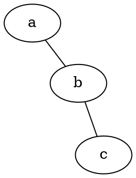
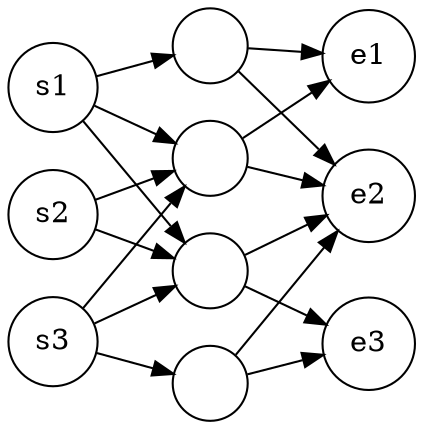
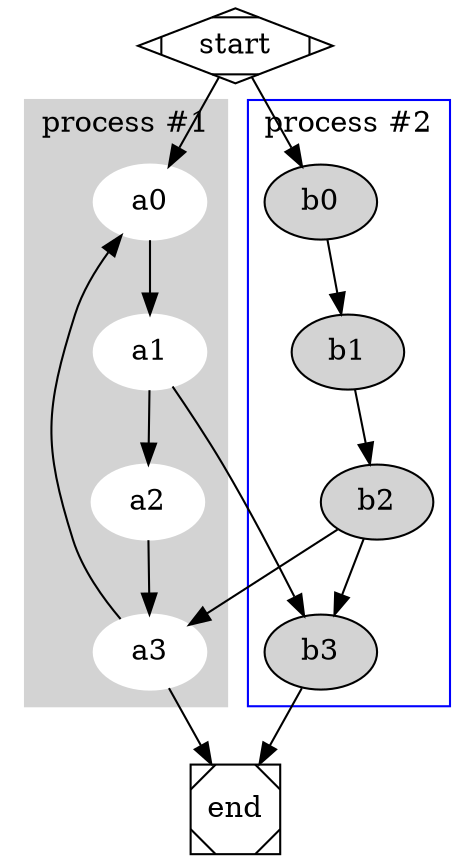

```dot
    graph anundirectedgraph {
    layout=neato;
    a -- b -- c;
}
```

```dot
Digraph G{
 rankdir = LR;
 node[shape=circle,background=gray]
 splines=false
 subgraph S{
  cluster=false;
  s1 s2 s3
 }
 subgraph E {
 e1 e2 e3
 }
 node[label=""];
 v1 v2 v3 v4 
 {
 s1 -> v1; s1 -> v2; s1 -> v3;
 s2 -> v3; s2 -> v2;
 s3 -> v2; s3 -> v3; s3 -> v4;
 }
 v1 -> e2; v1 -> e1;
 v2 -> e2; v2 -> e3;
 v3 -> e1; v3 -> e2;
 v4 -> e3; v4 -> e2;
}
```

```dot
Digraph G{
 rankdir = LR;
 node[shape=circle,background=gray]
 splines=false
 subgraph S{
  cluster=false;
  s1 s2 s3
 }
 subgraph E {
 e1 e2 e3
 }
 node[label=""];
 v1 v2 v3 v4 
 {
 s1 -> v1; s1 -> v2; s1 -> v3;
 s2 -> v3; s2 -> v2;
 s3 -> v2; s3 -> v3; s3 -> v4;
 }
 v1 -> e2; v1 -> e1;
 v2 -> e2; v2 -> e3;
 v3 -> e1; v3 -> e2;
 v4 -> e3; v4 -> e2;
}
```


```dot
    digraph G {

      subgraph cluster_0 {
        style=filled;
        color=lightgrey;
        node [style=filled,color=white];
        a0 -> a1 -> a2 -> a3;
        label = "process #1";
      }

      subgraph cluster_1 {
        node [style=filled];
        b0 -> b1 -> b2 -> b3;
        label = "process #2";
        color=blue
      }
      start -> a0;
      start -> b0;
      a1 -> b3;
      b2 -> a3;
      a3 -> a0;
      a3 -> end;
      b3 -> end;

      start [shape=Mdiamond];
      end [shape=Msquare];
    }
```

```tikz
\begin{tikzcd}
A \arrow[r, "f"] \arrow[rd, "g \circ f"] & B \arrow[d, "g"] \\
                                         & C               
\end{tikzcd}
```
