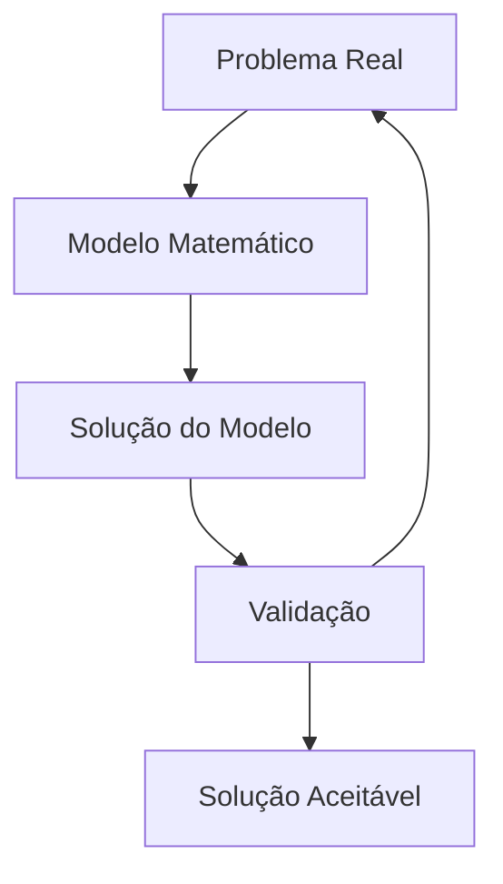

## Definição

O modelo é toda a informação de um determinado problema de otimização linear e todas as variáveis que possam influenciar o resultado final.
## Modelagem

#### Variáveis do modelo
- Variáveis de decisão $x_1,\ x_2,\ ...,\ x_n$ (e seus respectivos pesos) $a_1,\ a_2,\ ...,\ a_n$
- Função objetivo $(max \lor min)\ f$
- Restrições do modelo

#### Condições
Para um modelo linear ser válido é necessário:
- Todas as variáveis $x_1,\ x_2,\ ...,\ x_n\ \in \mathbb{R}$ 
- $x_i \ge 0\ \ \forall i \le n$ (não negatividade)
- Variáveis devem ser _lineares_ (polinômios de ordem 1)

#### Combinação Ótima
Dada essas condições, o resultado da função objetivo deve ser uma combinação linear de todas as variáveis do problema. A meta do modelo é encontrar a combinação ótima, isso é, combinação onde as variáveis, dentro das restrições, melhor cumprem a função objetivo.
$$X =\large \sum_{i} x_i a_i$$