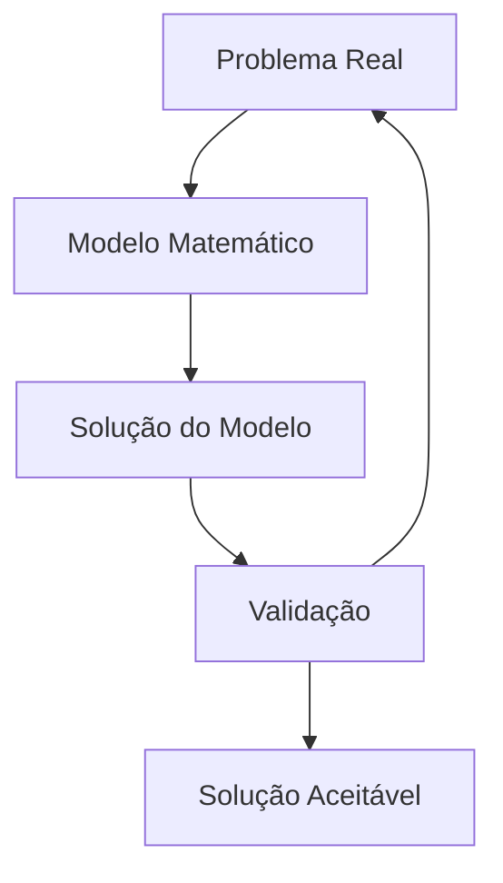

## Definição

O modelo é toda a informação de um determinado problema de otimização linear e todas as variáveis que possam influenciar o resultado final.
## Modelagem

#### Variáveis do modelo
- Variáveis de decisão $x_1,\ x_2,\ ...,\ x_n$ (e seus respectivos pesos) $a_1,\ a_2,\ ...,\ a_n$
- Função objetivo $(max \lor min)\ f$
- Restrições do modelo

#### Condições
Para um modelo linear ser válido é necessário:
- Todas as variáveis $x_1,\ x_2,\ ...,\ x_n\ \in \mathbb{R}$ 
- $x_i \ge 0\ \ \forall i \le n$ (não negatividade)
- Variáveis devem ser _lineares_ (polinômios de ordem 1)

#### Combinação Ótima
Dada essas condições, o resultado da função objetivo deve ser uma combinação linear de todas as variáveis do problema. A meta do modelo é encontrar a combinação ótima, isso é, combinação onde as variáveis, dentro das restrições, melhor cumprem a função objetivo.
$$X =\large \sum_{i} x_i a_i$$
## Propriedades
### Variáveis básicas e não básicas
Na [[Modelo#Forma padrão|forma padrão]] o modelo terá um set de restrições, dependendo da função objetivo essas restrições podem ser básicas ou não básicas, isto é, se elas forem básicas elas são restrições ativas em uma determinada solução, se elas forem não-básicas logo elas não são ativas e seu valor respectivo é 0.
### Maximização e Minimização
$$\large \begin {gather} \max(f) = \min(-f) \\ \min(f) =\max(-f) \end{gather}$$

## Forma canônica

É a forma mais intuitiva do modelo, com todas as variáveis e pesos estabelecidos e restrições.
$$\begin{gather} \large (\max | \min) Z = \sum_i^n x_ia_i
\\ \text{sujeito a } r \in \mathbb{N} \text{ restrições de forma que}\\
\\ c_{11} x_1 + \dots + c_{n1} x_n\ (\le | \ge)\ k_1
\\ \vdots
\\ c_{1r}\ x_1 + \dots + c_{nr} x_n\ (\le | \ge)\ k_r
\end{gather}$$
## Forma padrão

Antes da resolução é usual estabelecer o problema pela forma padrão é a forma com todas as desigualdades convertidas para igualdade por meio de [[Variável de Folga|variáveis de folga]]. Também é costumeiro passar $Z$ para o outro lado da igualdade em alguns casos.
$$\begin{gather} \large (\max | \min) Z = \sum_i^n x_ia_i
\\ \text{sujeito a } r \in \mathbb{N} \text{ restrições de forma que}\\
\\ c_{11} x_1 + \dots + c_{m1} x_m = k_1
\\ \vdots
\\ c_{1r} x_1 + \dots + c_{mr} x_m = k_r
\end{gather}$$

## Forma mista
...